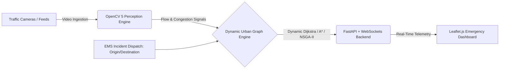

# FlowSense: Priority Routing & Perception for Emergency Response [](https://opencv.org/) [](https://aws.amazon.com/) [](https://fastapi.tiangolo.com/) [](https://github.com/Dmgar/project_Flowsense)

> **Real-Time Computer Vision & Urban Graph Modeling for Emergency Vehicles (Ambulances & Fire Trucks)**
> Proposal for the **OpenCV AI Competition 2026, powered by AWS**.

---

## One-Line Pitch

**FlowSense** leverages **OpenCV 5** on traffic cameras to extract real-time congestion and lane availability signals, dynamically updating an urban graph to compute zero-latency optimal corridors for **ambulances and fire trucks** navigating congested cities.

---

## The Problem: The Golden Hour Bottleneck

Emergency response systems (EMS and Fire Departments) rely heavily on historical GPS routing or static distance calculations. During medical traumas or structural fires, every second counts towards the *"Golden Hour"*. Static models fail because they cannot perceive:

- Bottlenecks, gridlocks, or localized accidents occurring **in real time**.
- Bottleneck intersections where an emergency vehicle might get trapped without shoulder space.
- Dynamic lane clearance before the emergency vehicle arrives.

The challenge is not just calculating shortest paths on OpenStreetMap, but **grounding routing algorithms with real-time perception signals from municipal traffic cameras**.

---

## Solution Architecture

FlowSense bridges computer vision perception with graph optimization in a three-tier pipeline:



### 1. Perception Engine (OpenCV 5 — Core)

- **Ingestion:** Feeds from municipal/DOT traffic cameras or urban traffic datasets (UA-DETRAC, BDD100K).
- **Detection & Tracking:** Powered by OpenCV 5's dnn module executing lightweight ONNX-exported object detection models alongside `cv2.Tracker` and optical flow estimation.
- **Congestion & Impedance Extraction:** Aggregated vehicle counts, estimated average flow velocity, and road impedance factors per segment/intersection.

### 2. Urban Emergency Graph (osmnx + networkx)

- The city road network is represented as a directed graph derived from OpenStreetMap.
- Instead of static travel times, edge weights ($W_e$) adjust dynamically based on OpenCV congestion metrics:
  $$W_e = \text{Length} \times \left(1 + \alpha \cdot \text{CongestionFactor}\right)$$
- Emergency routing algorithms prioritize wide avenues, clearance velocity, and safety over purely physical shortest distances.

### 3. Dispatch Operations Dashboard

- **FastAPI** backend streaming recalculated routes, corridor clearance signals, and telemetry via WebSockets.
- **Leaflet.js** web frontend displaying an interactive 'digital twin':
  - Color-coded street congestion levels.
  - Active emergency units tracking along dynamically re-routing green corridors.

## AWS Cloud Architecture (Scoped to Free Tier)

Designed for practical, low-cost execution within AWS Free Tier limits:

- **Development & Prototyping:** Vision inference runs locally on sampled datasets to preserve cloud resources.
- **Stream Ingestion & Batch Store:** Amazon S3 for storing model weights, map extracts, and recorded evaluation clips.
- **Orchestration & Backend:** FastAPI app hosted on an AWS Free Tier EC2 instance (t2.micro / t3.micro), coordinating graph state and WebSocket clients.
- **Cost Controls:** Real-time billing alerts and usage caps enforced from day one.

## Tech Stack

| Domain | Technologies |
| :--- | :--- |
| **Computer Vision** | OpenCV 5 (dnn, tracking, optical flow), ONNX Runtime, YOLO-based models |
| **Urban Graph & Routing** | osmnx, networkx, scipy |
| **Backend & Real-Time** | Python 3.10+, FastAPI, WebSockets, Uvicorn |
| **Frontend & GIS** | Leaflet.js, HTML5, CSS3, GeoJSON |
| **Cloud & Deployment** | AWS (EC2, S3, IAM), Docker |

## Documentation

For deep technical dives into the specific modules, check the versioned documentation:

- [Frontend Iteration 1](docs/FLOWSENSE_FRONTEND_V1.md)
- [Backend Green Wave Simulation](docs/FLOWSENSE_BACKEND_V3.md)
- [Perception Engine & Advanced Routing](docs/FLOWSENSE_PERCEPTION_AND_ROUTING_V4.md)

## Roadmap (Aug 26 – Oct 26)

| Weeks | Phase | Core Deliverable | Status |
| :--- | :--- | :--- | :--- |
| 1–2 | Graph & Base Vision | Extract pilot city graph via osmnx. Implement initial vehicle detection with OpenCV 5. | ✅ Done |
| 3–4 | Density Metrics | Build road segment impedance algorithm based on vehicle counts and flow velocity. | ✅ Done |
| 5–6 | Emergency Routing Engine | Dynamic weight integration on networkx (A* Multi-criteria). Emergency clearance path selection. | 🚧 In Progress |
| 7–8 | Real-Time Dispatch Dashboard | FastAPI WebSocket pipeline connected to interactive Leaflet.js command map. | 🚧 In Progress |
| 9–10 | Benchmarking & Submission | Simulated response time reduction benchmarks, project video, and final documentation. | 🚧 In Progress |

## Engineering Team

- Dariem Garcia
- Jesus Campo Yuunes
- Thomas Cristhancho
- Daniel Franco

## Responsible AI & Privacy Guarantee

- **Zero Surveillance:** The perception engine processes aggregate vehicle counts and flow densities only.
- **Privacy by Design:** No facial recognition or license plate identification (ALPR) is performed or stored.
- **Data Compliance:** Uses exclusively public research datasets (UA-DETRAC, BDD100K) and open municipal streams without expectation of personal privacy.

## Getting Started

```bash
# Clone the repository
git clone https://github.com/Dmgar/project_Flowsense.git
cd project_Flowsense

# Create and activate environment
python -m venv venv
source venv/bin/activate # Windows: venv\Scripts\activate

# Install dependencies (once published)
pip install -r requirements.txt
```

## License

This project is licensed under the MIT License - see the [LICENSE](https://www.google.com/search?q=LICENSE) file for details.
